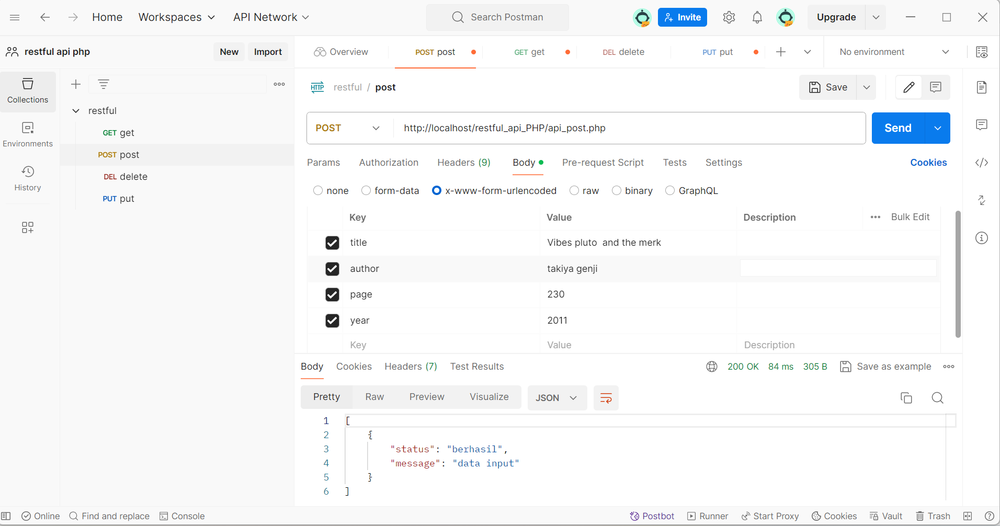

# Book API README

## Introduction

This PHP script provides a simple RESTful API to interact with a books database. The API supports the following HTTP methods: GET, POST, PUT, and DELETE. The API returns responses in JSON format.

## Usage

### GET Method

Retrieves all books from the database.
URL: `/path/to/your/script.php`
Method: GET

### POST Method

Adds a new book to the database.
URL: `/path/to/your/script.php`
Method: POST

### PUT Method

Updates an existing book in the database.
URL: `/path/to/your/script.php`
Method: PUT

### DELETE Method

Deletes a book from the database.
URL: `/path/to/your/script.php`
Method: DELETE

## Image

